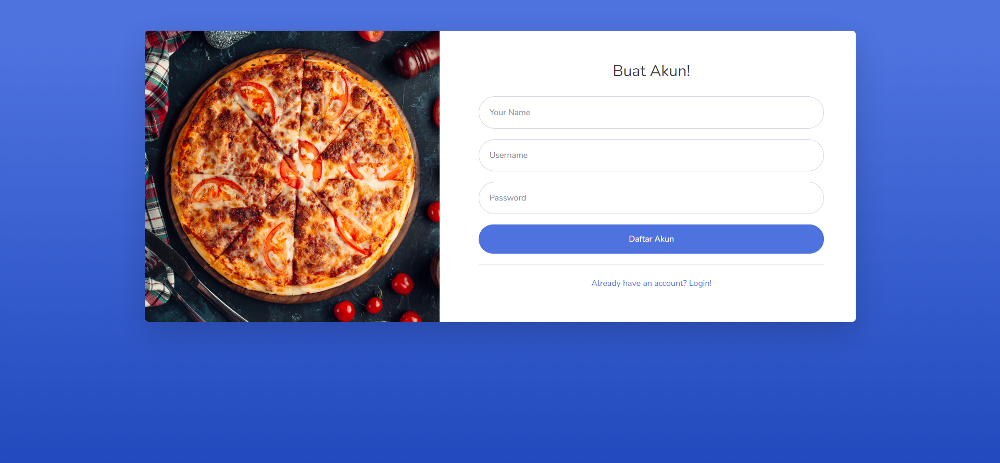

# [Suliid Burger](https://terbawasuasana.com/burger-uas/) - Food and Beverage
**Suliid Burger** adalah sebuah website restoran yang mengusung konsep pemesanan makanan secara online. Dengan Suliid Burger, pelanggan dapat dengan mudah menjelajahi menu burger yang lezat, melakukan pemesanan, dan melakukan pembayaran secara langsung melalui website kami.

## Fitur Utama
- **Pemilihan Menu**: Jelajahi berbagai pilihan burger, fries & sides, drinks dan desserts.
- **Pemesanan Online**: Pesan makanan secara langsung melalui website dengan antarmuka yang mudah digunakan.
- **Pengelolaan Pesanan**: Lihat status pesanan
- **Pembaruan Menu**: User dapat menambah, mengedit, atau menghapus item menu melalui panel admin.
- **Dashboard Admin**: Admin dapat menambah, edit dan menghapus user pengguna.

## Team
- Cassiel D. Ferdinand
- Siti Shalu Prilia
- M. Vico Lacosto

## Prerequisites
- PHP (Codeigniter 3)
- Database (MySQL)
- PHPMailer

## Akun Login (ADMIN | Cassiel D. Ferdinand)
- username: admin
- password: admin123

### Akun Login (USER | Siti Shalu Prilia)
- username: shalu
- password: shalu123
  
### Akun Login (USER | M. Vico Lacosto)
- username: vico
- password: vico321

## Tampilan Halaman Utama

### Tampilan Menu

### Tampilan Gallery

### Tampilan Team

### Tampilan Location

### Tampilan Contact

### Tampilan Footer

## Tampilan Login dan Register

## Tampilan Dashboard Admin
### Tampilan CRUD Menu

### Tampilan CRUD Users

## Tampilan Dashboard User
### Tampilan CRUD Orders

